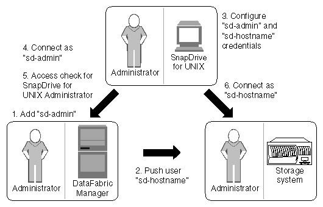

= SnapDrive for UNIX と Operations Manager コンソールの連携
:allow-uri-read: 
:icons: font
:imagesdir: ../media/

[role="lead"]
ロールベースアクセス制御（ RBAC ）の使用は、 Operations Manager コンソールのインフラによって異なります。Operations Manager コンソール管理者は、 UNIX 用の SnapDrive のユーザ名を作成する必要があります。すべてのストレージ操作要求は、最初に Operations Manager コンソールに送信されてアクセスチェックが行われます。Operations Manager コンソールで特定の SnapDrive ユーザのストレージ操作が検証されると、処理が完了します。

次の図は、ストレージ処理用の RBAC 全体を示しています。

. Operations Manager コンソール管理者が、 Operations Manager コンソールに SD-admin ユーザを追加しました。
. Operations Manager コンソール管理者がストレージシステムに SD-hostname ユーザを作成します。
. Operations Manager コンソールの管理者は、 SD-admin と SD-hostname のクレデンシャルを SnapDrive for UNIX 管理者に送信します。
. SnapDrive 管理者が、受信したユーザクレデンシャルを使用して SnapDrive を設定し
. SnapDrive 管理者が追加したユーザクレデンシャルを使用して、 Operations Manager コンソールで SnapDrive for UNIX のアクセスチェックが実行されます。
. SnapDrive ユーザの認証が完了すると、ユーザはストレージシステムに接続できるようになります。

SnapDrive ユーザがストレージ操作を実行する場合は、コマンドラインで対応するコマンドを実行します。要求は、アクセスチェックのために Operations Manager コンソールに送信されます。Operations Manager コンソールは、要求されたユーザに SnapDrive 処理を実行するための適切な権限があるかどうかをチェックします。アクセスチェックの結果が SnapDrive に返されます。この結果に応じて、ユーザはストレージシステムに対してストレージ操作を実行できます。

アクセスチェック後にユーザが確認された場合、ユーザは SD-hostname としてストレージシステムに接続します。

NOTE: 推奨されるユーザ名は SD-hostname と SD-admin です。SnapDrive for UNIX に他のユーザ名を設定できます。
