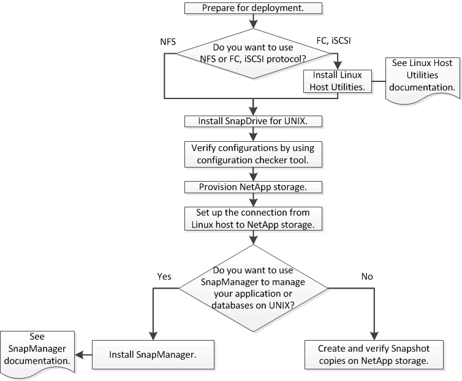

= 導入のワークフロー
:allow-uri-read: 
:icons: font
:imagesdir: ../media/

[role="lead"]
SnapDrive で Snapshot コピーを作成する前に、 Linux Host Utilities （ FC プロトコルまたは iSCSI プロトコルを使用する場合）、 SnapDrive for UNIX をインストールし、 SnapDrive でサポートされる構成を確認し、ストレージをプロビジョニングし、 Linux ホストからネットアップストレージシステムへの接続をセットアップする必要があります。

